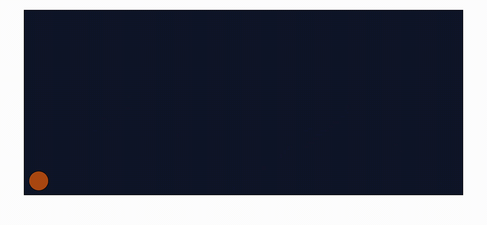

# Bouncing Ball Animation

A simple and smooth **bouncing ball animation** built using pure CSS.  
This project demonstrates motion, gravity effect, and boundary control.

---

## Preview

---

## Technologies Used

- HTML
- CSS

---

## Features

- Smooth CSS animation
- Responsive container
- Pure HTML & CSS (no JS)
- Beginner-friendly structure
- Use single animation for both vertical and horizontal motion

---

## Learning Outcome

- CSS animations
- `@keyframes`
- Positioning & transforms
- UI motion principles

---

## How to Run

1. Download or clone the repository.
2. Make sure `index.html` and `style.css` are in the same folder.
3. Open `index.html` in any modern web browser.

---

## Contributing

Contributions, suggestions, and improvements are welcome!

---

## License

This project is open source and free to use for learning purposes.

⭐ If you like this project, consider giving it a star!

---

## Author
**Ankit Gangwar**
