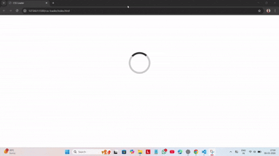

# CSS Loader Animation

A simple circular **loading spinner animation** built using pure **HTML and CSS**.  
This project demonstrates how to create a smooth rotating loader using **CSS animations and borders**.

---

## Live Demo

👉[Live Demo](https://coruscating-florentine-8b9334.netlify.app/)

---

## Technologies Used

- HTML5
- CSS3
- CSS Animations
- Keyframes

---

## Features

- Lightweight
- Pure CSS animation
- No JavaScript required
- Smooth infinite rotation
- Beginner friendly project

---

## Learning Outcome

- CSS `@keyframes` animation
- Creating loaders using borders
- Rotating elements using `transform: rotate()`

---

## How to Run

1. Download or clone the repository. _or simply download index.html_
2. Open `index.html` in any modern web browser.

---

## Contributing

Contributions, suggestions, and improvements are welcome!

---

## License

This project is open source and free to use for learning purposes.

⭐ If you like this project, consider giving it a star!

---

## Author
**Ankit Gangwar**
- GitHub: https://github.com/ankitgangwar0012
