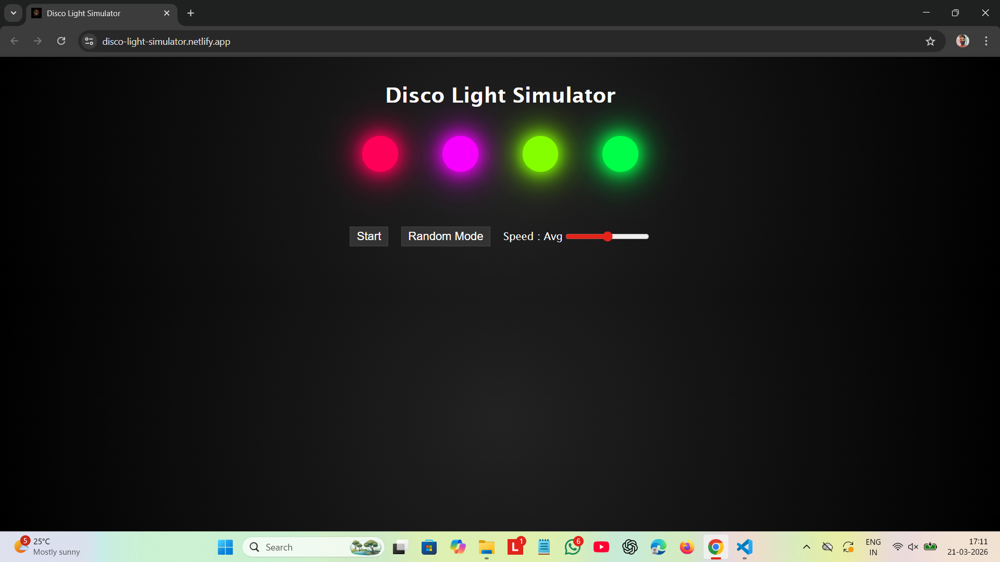

# GlowSync – Interactive Disco Light Simulator
An interactive and visually appealing **Disco Light Simulator** built using **HTML, CSS, and JavaScript**.
This project mimics colorful disco lighting effects with dynamic animations, multiple modes, and speed control.

---

## Live Demo

👉[Live Demo](https://disco-light-simulator.netlify.app/)

---

## Technologies Used

- HTML5
- CSS3 
- JavaScript

---

## Features

- Dynamic color-changing disco lights
- Multiple lighting modes:
- Random Mode (all bulbs change colors randomly)
Wave Mode (colors move in sequence)
- Adjustable speed control:
- Min / Avg / Max speed levels
- Start / Stop functionality
- Fully responsive design

---

## Learning Outcome

- DOM Manipulation
- Event Listeners
- `setInterval()` & `clearInterval()`
- CSS Transitions & Glow Effects
- Responsive Design using Media Queries

---

## How to Run

1. Download or clone the repository.
2. Open `index.html` in any modern web browser.

---

## Contributing

Contributions, suggestions, and improvements are welcome!

---

## License

This project is open source and free to use for learning purposes.

⭐ If you like this project, consider giving it a star!

---

## Author
**Ankit Gangwar**
