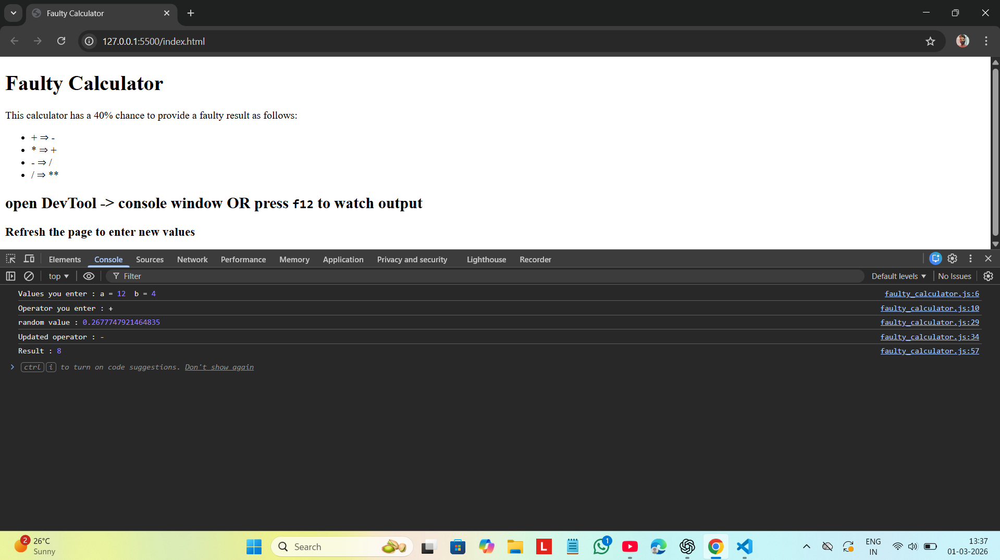

# Faulty Calculator – JavaScript Project

A fun and interactive Faulty Calculator built using HTML5 and JavaScript.
This project performs normal calculations but intentionally gives wrong results 40% of the time for learning and practice purposes.

---

## Live Demo

---

## Technologies Used

- HTML5
- JavaScript (ES6)
- Browser Console
- Math.random()

---

## Features

- Takes user input using `window.prompt()`
- Supports operators:`+`, `-`, `*`, `/`
- 40% chance to modify the operator intentionally
- Random fault generator using `Math.random()`
- Console-based output display
- Simple and beginner-friendly logic
- Demonstrates function usage and condition handling

---

## How It Works

- The user enters two numbers.
- The user selects an operator.
- A random number is generated.
- If the random value is less than or equal to 0.4, the operator is changed:

  - `+` → `-`

  - `*` → `+`

  - `-` → `/`

  - `/` → `**`

- The result is then calculated and shown in the console.

---

## Learning Outcome

- Understanding conditional statements (`if-else`)
- Working with functions
- Using arrow functions
- Handling user input with `window.prompt()`
- Converting string input into numbers
- Generating random values using `Math.random()`
- Basic debugging using browser console

---

## How to Run

1. Download or clone the repository.
2. Make sure `index.html` and `faulty_calculator.js` are in the same folder.
3. Open index.html in any modern web browser.
4. Open DevTools → Console (Press `F12`) to see the output.
5. Refresh the page to try again.

---

## Contributing

Contributions, suggestions, and improvements are welcome!

---

## License

This project is open source and free to use for learning purposes.

⭐ If you like this project, consider giving it a star!

---

## Author
**Ankit Gangwar**
