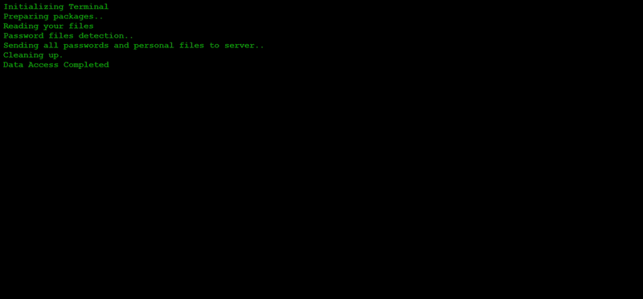

# 💻 Hackers Terminal Simulator
A simple **fake hacker terminal simulation** built using **HTML, CSS, and JavaScript**.
It creates a realistic terminal-like experience with dynamic text output and random delays to mimic hacking activity.

---

## Live Demo

👉[Live Demo](https://hackers-terminal-fun-project.netlify.app/)

---

## Technologies Used

- HTML5
- CSS3 
- JavaScript (Async/Await, Promises)

---

## Features

- Terminal-style UI (black background + green text)
- Random delay for realistic execution
- Animated "..." loading effect
- Async/Await based execution
- Simulated hacker messages

---

## Learning Outcome

- How to use JavaScript Async/Await for sequential execution
- Understanding Promises and handling delays using setTimeout
- Creating dynamic content using DOM Manipulation
- Simulating real-world behavior with random delays
- Using setInterval for animations (loading dots effect)
- Writing cleaner asynchronous code instead of callback hell
- Designing a simple terminal-style UI with CSS
- Structuring small frontend projects in a clean and organized way

---

## How to Run

1. Download or clone the repository.
2. Open `index.html` in any modern web browser.

---

## Contributing

Contributions, suggestions, and improvements are welcome!

---

## License

This project is open source and free to use for learning purposes.

⭐ If you like this project, consider giving it a star!

---

## Author
**Ankit Gangwar**
