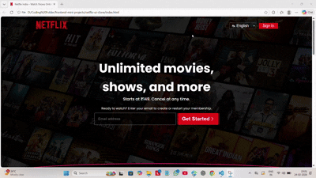

# Netflix Clone – Frontend Project

A fully responsive Netflix Landing Page Clone built using HTML5 and CSS3.  
This project replicates the design and layout of Netflix India's homepage for learning and practice purposes.

---

## Live Demo

👉[Live Demo](https://netflax-dotcom.netlify.app/)

---

## Technologies Used

- HTML5
- CSS3
- Flexbox
- CSS Grid
- Media Queries

---

## Features

- Hero section with background image and overlay
- Horizontally scrollable “Trending Now” movie section
- Modern UI with hover animations
- Fully responsive design (Desktop, Tablet, Mobile)
- FAQ section layout
- Language selection dropdown
- Email subscription call-to-action section
- Structured footer with multiple link columns

---

## Responsive Design

The layout adapts to different screen sizes using media queries:

- Desktop (1200px and above)
- Tablet (below 1200px)
- Mobile (below 580px)

---

## Learning Outcome

- Building complex layouts using Flexbox and Grid
- Creating horizontal scrollable sections
- Using pseudo-elements (::before)
- Implementing responsive web design
- Working with positioning and transforms
- Adding smooth hover animations and transitions

---

## How to Run

1. Download or clone the repository.
2. Make sure `index.html` , `style.css` and `image folder` are in the same folder.
3. Open `index.html` in any modern web browser.

---

## Contributing

Contributions, suggestions, and improvements are welcome!

---

## License

This project is open source and free to use for learning purposes.

⭐ If you like this project, consider giving it a star!

---

## Author
**Ankit Gangwar**

