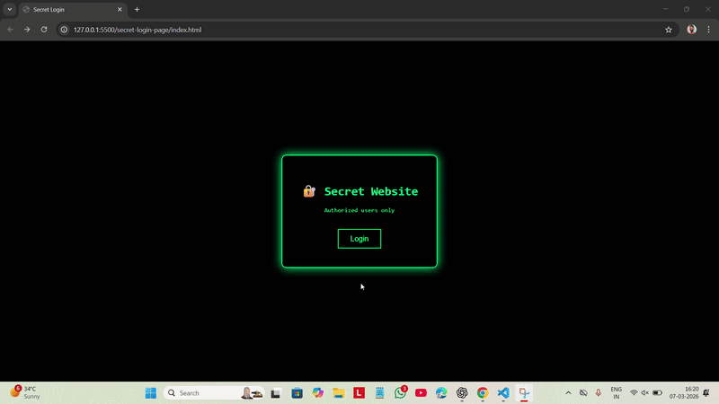

# 🔐 Secret Login Page

A fun JavaScript mini project that simulates a password-protected website.

When the user clicks the Login button, a password prompt appears.
If the correct password is entered, the user gets access to the secret page.

---

## Preview
A simple secret login page with a hacker-style interface.

---

## Technologies Used

- HTML5
- CSS3
- JavaScript

---

## Features

- Password prompt
- Access confirmation
- Redirect to another website
- Hacker-style UI

---

## Concepts Practiced

- prompt()
- confirm()
- alert()
- if-else conditions
- location.href redirect

---

## How to Run

1. Download or clone the repository.
2. Make sure `index.html` , `style.css` and `script.js` are in the same folder.
3. Open `index.html` in any modern web browser.

---

## Contributing

Contributions, suggestions, and improvements are welcome!

---

## License

This project is open source and free to use for learning purposes.

⭐ If you like this project, consider giving it a star!

---

## Author
**Ankit Gangwar**
