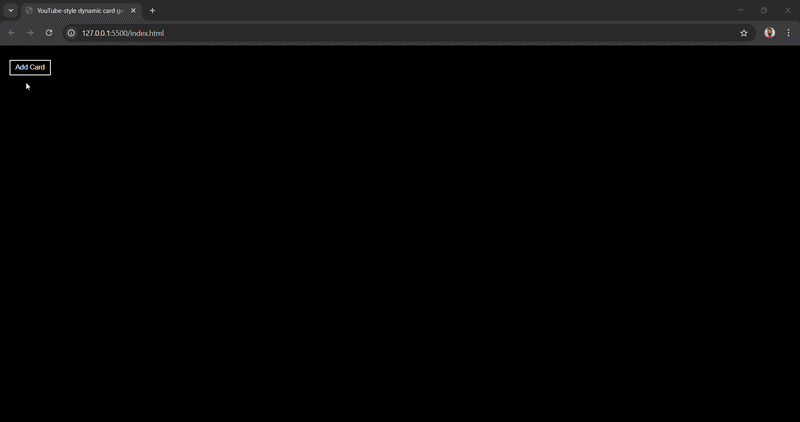

# YouTube Card Generator

A simple and dynamic web project that generates YouTube-style video cards using JavaScript. This project demonstrates DOM manipulation, dynamic UI rendering, and responsive card design.

---

## Preview



👉[Live Demo](https://youtube-card-generator-f4dd04.netlify.app/)

---


## Features

- Dynamically generate video cards
- Thumbnail preview with duration overlay
- View count formatting (K / M)
- Video title, channel name, and upload time
- Clean and minimal UI design
- Built with pure HTML, CSS, and JavaScript

---

## Tech Stack

- **HTML5**
- **CSS3**
- **JavaScript (DOM Manipulation)**

---

## 📂 Project Structure

```
├── index.html
├── style.css
├── script.js
├── assets
├── preview
└── README.md
```

---

## How It Works

* A function `genCard()` dynamically creates video cards.
* It takes parameters like:

  * Video Title
  * Channel Name
  * Views
  * Upload Time
  * Duration
  * Thumbnail
* Cards are appended to the container using JavaScript.

---

## Usage

1. Clone the repository:

   ```bash
   git clone https://github.com/your-username/your-repo-name.git
   ```

2. Open `index.html` in your browser.

3. Click **"Add Card"** button to generate a new video card.

---

## Learning Concepts

* DOM Manipulation
* Template Literals
* Dynamic HTML Rendering
* Event Handling
* Conditional Formatting (Views in K/M)

---

## 👨‍💻 Author

**Ankit Gangwar**

---

⭐ If you like this project, don't forget to give it a star!
